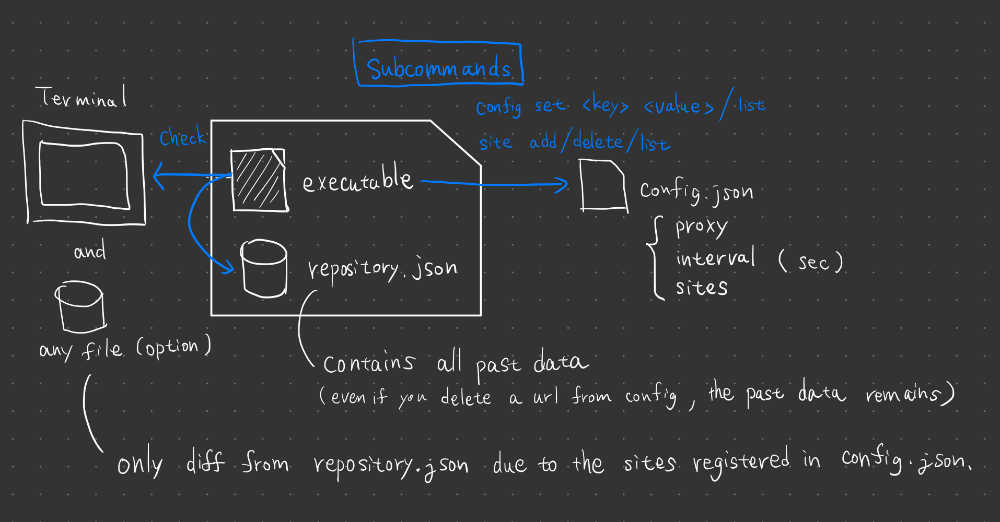

# go-sitecheck
CLI to check updates of web sites you want to check.

## Features
- No dependencies. Written in pure Go.
- Single binary. Easy to install. Just download and run.

## How does it work?
- Send HEAD request to the web site you want to check.
- Get the header value `Last-Modified` from the response.
- Compare the value with the value in the locally saved file.

## Installation
### Download binary
Download binary from [release page](https://github.com/tenkoh/go-sitecheck/releases).

### Use `go install`
If you use Go usually, using `go install` is the easiest way to install.

```bash
go install github.com/tenkoh/go-sitecheck@latest
```

## Basic usage
1. Add web sites you want to check.
```bash
./sitecheck site add https://example.com (site's url to register)
```

2. Check site list (optional).
```bash
./sitecheck site list
```

3. Run check. If there are updates, they are shown in the terminal.
```bash
./sitecheck check
```

After running `check`, `repository.json` file is created in the current directory. This file contains the information of the update history of the web sites you registered.

## Advanced usage
### Use proxy
1. Set proxy server.
```bash
./sitecheck config set proxy http://proxy.example.com:8080
```

2. Show proxy list (optional).
```bash
./sitecheck config list
```

3. Run check with proxy flag.
```bash
./sitecheck check -p
```

### Sve the result to a file.
1. Run check with output flag.
```bash
./sitecheck check -o result.txt
```

## Show help
```bash
./sitecheck -h
```

## Reference: data structure


## Contribution
Any contribution is welcome. Please feel free to open an issue or pull request.
Especially, realizing any milestone in the roadmap makes me very happy.

## Roadmap
- Improve user interface
  - Use fuzzy finder to add / detele web sites from registered list.
  - Use progress bar to show progress of checking.


## License
MIT

## Author
tenkoh
